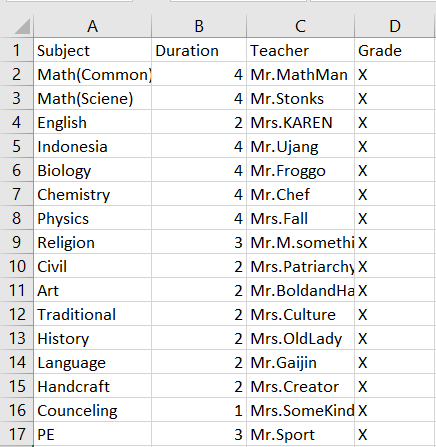
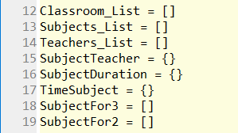
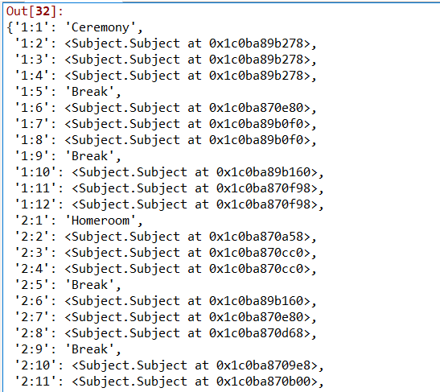
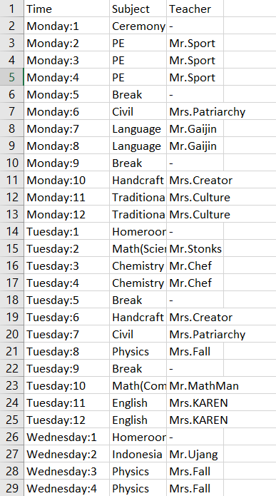

# Class Schedule Maker
Class schedule maker is a python code that will make a class schedule from an excel file containing the subject, the subject duration, and teacher responsible for that subject. This code can make a schedule for one class and randomizes everytime it is executed. It is also prioritize the subject stacking, for example. Math for 2 hours simultaneously instead of spread for 1 hour through the day. This code will export an excel file containing the finished schedule and can only do so if there is no file that has the same name as the file that the code outputs.

## Technologies
Project is created with:
* Python

### Libraries
The libraries that are used in this project are:
* csv
* xlsxwriter
* random

## Launch
This code will require a 'Subject.csv' file to work as its input. this file will contain subject, subject duration, and teacher

## Features
* Create a randomize schedule for a class
* Stacked subject as in the subject will have a 2 hours or 3 hours duration
* Limit the subject duration by editing the input file

## How it works
1. Create necessary lists and dictionaries from the input csv file

2. Pick the next subject to be added by sifting through the list for the remaining subject duration and the previous subject and then add it to the classroom class

3. Export the schedule to excel file

